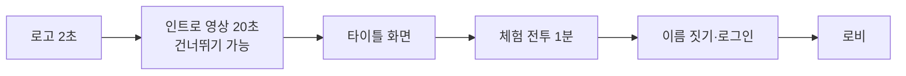
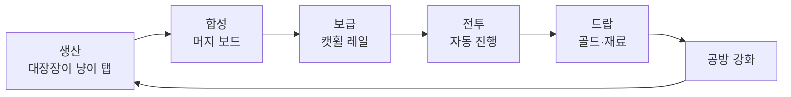
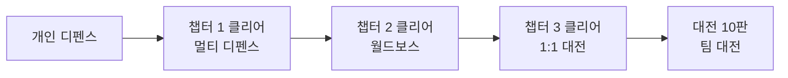
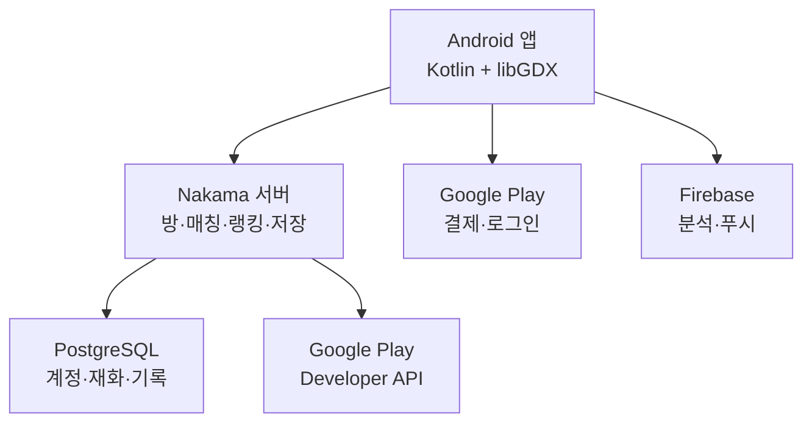
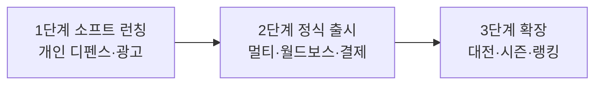

# 머지냥 디펜스 — 게임 기획서

2026-09-17 · 이재원

## 개요

후방 공방의 고양이가 아이템을 합성해 전방 고양이 부대에 보급하고, 많이 만들수록 부대가 강해지는 머지 × 자동전투 게임입니다.

| 항목 | 내용 |
| --- | --- |
| 가칭 | 머지냥 디펜스 |
| 장르 | 머지 퍼즐 + 오토배틀 디펜스 |
| 화면 | 세로형, 한 손 플레이 |
| 플랫폼 | Android 네이티브(Google Play) |
| 타깃 | 머지·방치형을 즐기는 캐주얼 유저, 고양이 좋아하는 10~30대 |
| 세션 길이 | 스테이지 1회 2~4분 |

핵심 감정은 "내가 만든 칼로 우리 고양이가 싸운다"는 직접 기여감입니다.

## 첫 접속 연출

첫 60초 안에 "고양이가 만들고, 고양이가 싸운다"는 핵심을 영상과 첫 합성으로 동시에 보여줍니다. 튜토리얼은 설명보다 손으로 해보게 합니다.

**인트로 영상 (약 20초, 2D 컷 애니메이션)**

1. 평화로운 고양이 마을, 햇살 아래 낮잠 자는 고양이들
2. 하늘이 어두워지며 쥐 군단과 괴물들이 몰려옴, 마을 울타리가 부서짐
3. 뚱냥이·전사냥이가 맨손으로 맞서지만 밀림
4. 뒤편 낡은 대장간에서 망치 소리, 대장장이 냥이가 첫 칼을 두드려 던짐
5. 칼을 받은 전사냥이가 빛나며 반격, "머지냥 디펜스" 로고가 망치 소리와 함께 박힘

**타이틀 화면**

- 배경: 대장간 화로가 은은히 타오르고, 모루 위 불꽃이 주기적으로 튐
- 화면을 탭하면 대장장이 냥이가 망치질하고 "터치하여 시작" 문구가 흔들림
- 계절·이벤트마다 배경 스킨 교체(벚꽃, 할로윈, 크리스마스)

**첫 체험 전투 (로그인 전, 약 1분)**

- 보드에 나뭇가지 2개만 놓여 있고, 손가락 가이드가 합성을 유도
- 합성된 생선뼈 단검을 레일로 끌어 보급하면 전사냥이가 한 방에 쥐를 날림
- 곧바로 보스급 거대 쥐 등장 → 미리 깔린 아이템으로 연쇄 합성 3번 → 피버 타임 → 승리
- 목적: 규칙 설명 없이 합성, 보급, 피버의 쾌감을 먼저 경험

**단계별 튜토리얼 (스테이지 1-1 ~ 1-5에 분산)**

| 스테이지 | 새로 배우는 것 |
| --- | --- |
| 1-1 | 생산 버튼과 에너지 |
| 1-2 | 방어구 라인, 뚱냥이 장착 |
| 1-3 | 소모품 보급과 회복 |
| 1-4 | 연쇄 합성과 5개 합성 |
| 1-5 | 첫 보스, 긴급 보급 |

**로비 화면**

- 중앙: 대장간 전경, 편성된 고양이 2마리가 돌아다니며 반응(쓰다듬기 가능)
- 하단 탭: 대장간(성장) · 고양이 · 전투(모드 선택) · 상점 · 랭킹
- 상단: 에너지, 골드, 보석, 우편함, 이벤트 배너
- 방치 보상이 쌓이면 대장간 앞에 상자가 수북이 쌓여 수령을 유도

## 코어 루프와 화면 구성

플레이어는 공방에서 생산·합성하고, 결과물을 보급해 전투를 이기며, 전리품으로 공방을 키웁니다.

루프 한 바퀴는 10~20초 안에 돌아야 손이 멈추지 않습니다.

| 영역 | 화면 비율 | 역할 |
| --- | --- | --- |
| 전선 | 상단 40% | 고양이 최대 5종(뚱냥이·전사냥이·궁사냥이·성직냥이·마법사냥이) 중 소환 슬롯 2개에 배치한 고양이가 오른쪽에서 오는 몬스터와 자동 전투 |
| 보급 레일 | 중간 띠 | 아이템을 올리면 대상 고양이에게 날아가 즉시 장착 |
| 공방 | 하단 60% | 7×5 머지 보드, 생산 버튼(에너지 1 소모) |

조작은 드래그 하나로 통일합니다. 아이템끼리 겹치면 합성, 레일이나 고양이 위에 놓으면 보급입니다.

## 머지 시스템과 아이템 라인

같은 라인·같은 단계 아이템 2개를 합치면 다음 단계 1개가 됩니다. 라인은 4개, 라인당 8단계로 시작합니다.

| 라인 | 1단계 | 3단계 | 5단계 | 8단계(최고) | 보급 효과 |
| --- | --- | --- | --- | --- | --- |
| 무기 | 나뭇가지 | 생선뼈 단검 | 불꽃검 | 전설의 츄르 블레이드 | 공격력 상승 |
| 방어구 | 골판지 | 냄비뚜껑 | 철갑 | 황금 캣타워 갑옷 | 방어력·체력 상승 |
| 소모품 | 멸치 | 통조림 | 참치회 | 황금 츄르 | 즉시 회복·버프 |
| 특수 | 털뭉치 | 털폭탄 | 번개 헤어볼 | 거대 헤어볼 | 전선 전체 광역 공격 |

**규칙**

- 단계가 1 오를 때마다 수치는 약 2.2배로 올려 합성할수록 체감이 커지게 합니다.
- 장비는 교체형입니다. 더 높은 단계를 보급하면 기존 장비는 골드로 환급됩니다.
- 생산 시 라인은 확률로 결정되며(무기 35%, 방어구 30%, 소모품 25%, 특수 10%) 공방 업그레이드로 비율을 조정할 수 있습니다.
- 가끔 보드에 상자·잠긴 칸이 나와, 주변에서 합성하면 열리도록 해 보드 정리에 목적을 줍니다.

## 전투·보급 시스템

전투는 완전 자동이고, 플레이어가 개입하는 유일한 수단이 보급입니다. 그래서 공방 손놀림이 곧 전투력입니다.

| 고양이 | 역할 | 우선 장착 | 특징 |
| --- | --- | --- | --- |
| 뚱냥이 | 탱커 | 방어구 | 몬스터 어그로, 방어구 효과 1.5배 |
| 전사냥이 | 근접 딜러 | 무기 | 공격 속도 빠름 |
| 궁사냥이 | 원거리 딜러 | 무기 | 후열 공격, 치명타 확률 높음 |
| 성직냥이 | 힐러 | 소모품 | 소모품 효과를 아군 전체에 확산 |
| 마법사냥이 | 광역 원거리 딜러 | 지팡이 | 화염구·얼음 폭발로 다수 몬스터 동시 타격 |

**보급 규칙**

- 레일에 올리면 역할에 맞는 고양이에게 자동 배달, 고양이 위에 직접 놓으면 지정 배달입니다.
- 장착 즉시 고양이 외형(무기·갑옷 스프라이트)이 바뀌고 머리 위에 수치 상승이 뜹니다.
- 특수 라인은 장착하지 않고 즉시 발동해 화면 전체를 공격합니다.
- 전선이 밀리면 고양이가 공방 쪽으로 후퇴하고, 공방에 닿으면 패배입니다.

웨이브 구성은 일반 몬스터 3웨이브 뒤 보스 1웨이브이며, 웨이브 사이 10초 정비 시간을 둡니다.

## 게임 모드 한눈에 보기

모드는 5가지이며, 개인 디펜스 진행도에 따라 차례로 열립니다. 모든 모드에서 1인당 전장 슬롯은 2마리로 같습니다.

| 모드 | 인원 | 해금 조건 | 입장 제한 | 주요 보상 |
| --- | --- | --- | --- | --- |
| 개인 디펜스 | 1인 | 처음부터 | 에너지 소모 | 골드, 재료, 고양이 해금 |
| 멀티 디펜스 | 2~5인 | 챕터 1 클리어 | 하루 보상 5회(이후 입장은 가능, 보상 감소) | 협동 재료, 멀티 전용 스킨 조각 |
| 월드보스 | 전 서버 | 챕터 2 클리어 | 하루 3회 | 월드보스 코인, 랭킹 보상 |
| 1:1 대전 | 2인 | 챕터 3 클리어 | 무제한(보상은 하루 10승) | 대전 트로피, 시즌 보상 |
| 팀 대전 | 2:2 / 3:3 | 1:1 대전 10판 | 무제한 | 팀 트로피, 시즌 보상 |

해금 시점마다 로비에 새 건물(협동 광장, 보스 제단, 투기장)이 세워지는 연출을 넣어 진행감을 줍니다.

## 개인 디펜스와 스테이지 구성

출시 시 5개 챕터 × 20스테이지 = 100스테이지로 시작하고, 이후 두 달마다 챕터 1개씩 추가합니다. 각 챕터는 테마, 몬스터, 새 규칙이 하나씩 다릅니다.

| 챕터 | 테마 | 대표 몬스터 | 새 규칙 | 챕터 보스 |
| --- | --- | --- | --- | --- |
| 1 | 고양이 마을 | 쥐 병사, 바퀴벌레 | 기본 규칙 학습 | 쥐왕 찍찍대제 |
| 2 | 어두운 숲 | 독버섯, 까마귀 | 독 상태이상 → 소모품 중요 | 까마귀 마녀 |
| 3 | 사막 피라미드 | 전갈, 미라 개 | 모래폭풍: 보급 레일 속도 감소 | 스핑크스 개 |
| 4 | 얼음 동굴 | 얼음 박쥐, 펭귄 기사 | 빙결: 보드 칸이 일시적으로 얼어붙음 | 거대 얼음 게 |
| 5 | 로봇 공장 | 청소기 로봇, 드론 | 방어막 몬스터 → 마법 필요 | 메카 진공청소기 |

**스테이지 구조**

- 한 챕터 20스테이지 중 5, 10, 15에는 중간 보스, 20에는 챕터 보스가 나옵니다.
- 스테이지 1회는 일반 3웨이브 + 보스 1웨이브, 약 2~4분입니다.
- 스테이지마다 추천 고양이 조합을 표시해 슬롯 2마리 선택에 전략을 줍니다.

**별 평가 (스테이지당 최대 3개)**

- 1개: 클리어
- 2개: 고양이 체력 50% 이상 유지
- 3개: 제한 시간 내 클리어 또는 피버 2회 발동
- 챕터별 별 20·40·60개 달성 시 보상 상자, 별 3개 스테이지는 소탕(즉시 보상) 가능

**난이도**

- 일반: 챕터 진행용
- 어려움: 일반 챕터 클리어 후 해금, 몬스터 강화와 추가 패턴, 희귀 재료 드랍
- 악몽: 어려움 클리어 후 해금, 최상위 장비 재료와 전용 칭호

**특수 스테이지**

- 요일 던전: 요일별로 골드, 무기 재료, 방어구 재료 중 하나를 집중 획득
- 무한의 탑: 층마다 강해지는 몬스터를 버티는 모드, 주간 최고층 랭킹 연동
- 이벤트 스테이지: 시즌 테마 몬스터, 한정 스킨 조각 지급

## 보스 구성

보스마다 "특정 라인이나 특정 고양이가 필요한 순간"을 하나씩 만들어, 합성 우선순위 판단을 강제합니다. 보스 체력이 70%, 30%일 때 패턴이 바뀝니다.

| 보스 | 챕터 | 핵심 패턴 | 공략 포인트 |
| --- | --- | --- | --- |
| 쥐왕 찍찍대제 | 1 | 쥐 떼 소환, 돌진 | 광역 공격(마법사냥이·특수 라인) |
| 까마귀 마녀 | 2 | 독 안개로 지속 피해 | 소모품 연속 보급, 성직냥이 |
| 스핑크스 개 | 3 | 수수께끼 버프: 지정 라인만 피해가 들어감 | 표시된 라인 아이템 긴급 합성 |
| 거대 얼음 게 | 4 | 보드 칸 빙결, 방어구 파괴 | 방어구 재보급, 빙결 전 합성 |
| 메카 진공청소기 | 5 | 보드 아이템 흡입, 보호막 | 흡입 전 합성, 마법으로 보호막 해제 |

**보스 연출**

- 등장: 화면이 흔들리며 전선이 어두워지고, 보스 이름 컷인과 전용 BGM 시작
- 패턴 예고: 2초 전 느낌표 경고와 레일 점멸로 긴급 보급 타이밍 안내
- 처치: 슬로모션 마지막 일격 → 보스가 터지며 골드 폭발 → 보상 상자 낙하

중간 보스는 챕터 보스의 부하로 패턴 1개만 가진 축소판을 써서 본 보스 공략을 미리 익히게 합니다.

## 멀티 디펜스

방은 항상 5인실로 열리고, 시작 시점의 인원(2~5인)으로 바로 진행합니다. 계정 성장은 개인 플레이와 동일하며 1인당 전장 슬롯은 2마리라, 5인이 모이면 전선에 10마리가 섭니다.

**방 구조**

- 빠른 참가: 비어 있는 방에 자동 입장
- 방 만들기: 공개 또는 비밀번호 방, 난이도 선택
- 초대: 친구 목록, 초대 코드
- 대기 시간 60초 또는 방장이 시작 버튼, 2인 이상이면 시작 가능
- 대기 중 편성 고양이 2마리를 서로 볼 수 있어 역할(탱커·딜러·힐러)을 맞출 수 있음

**플레이 규칙**

- 각자 자기 공방 보드에서 합성하고, 보급은 자기 슬롯 고양이에게만 됩니다.
- 소모품과 특수 라인은 예외로 팀 전체에 효과가 들어가 협동감을 줍니다.
- 몬스터 수와 체력은 인원수에 비례해 늘어납니다(인원 1명당 약 +80%).
- 전선은 하나이며, 전선이 무너지면 전원 패배합니다.
- 중도 이탈자의 고양이는 자동 전투만 계속하고 보급은 끊깁니다.

**팀 협동 요소**

- 합동 피버: 모든 참가자의 콤보 게이지 합이 가득 차면 전원 동시 광폭화
- 도움 요청 핑: 탭 한 번으로 "방어구 필요", "힐 필요" 알림 표시
- 이모티콘: 고양이 스티커 8종(유료 스티커 추가 판매)

**보상**

- 기본 보상은 전원 동일, 기여도(피해량·보급 횟수·회복량) 1위에게 추가 상자
- 인원이 많을수록 보상 배율 상승(2인 1.0배 → 5인 1.4배)로 모집 동기 부여
- 멀티 전용 재화로 협동 상점에서 스킨 조각, 재료 교환

## 월드보스

모든 유저가 같은 거대 보스 하나의 체력을 함께 깎는 주간 콘텐츠입니다. 개인 도전은 1회 90초이며, 그동안 넣은 피해가 전 서버 누적 체력에서 빠집니다.

**운영 주기**

- 월요일 오전 10시 등장, 일요일 밤 10시 종료
- 하루 입장 3회, 광고 시청으로 1회 추가
- 주마다 보스가 교체되며 4주 주기로 순환

| 월드보스 | 특징 | 유리한 조합 |
| --- | --- | --- |
| 고대 뱀장어 킹 | 전기 충격으로 무기 효과 감소 | 방어구 탱커 + 마법사냥이 |
| 하늘 고래 | 공중 유닛이라 근접 피해 절반 | 궁사냥이 + 마법사냥이 |
| 쓰레기산 골렘 | 파편 소환, 시간 지날수록 단단해짐 | 초반 폭딜, 피버 조기 발동 |
| 암흑 개대왕 | 90초 중 3번 광폭화 | 성직냥이 + 뚱냥이 생존 조합 |

**진행 연출**

- 로비 상단에 전 서버 체력 바가 실시간으로 줄어듦
- 체력 75%, 50%, 25% 달성 시 전체 우편으로 단계 보상 지급
- 처치 성공 시 전원에게 처치 보상, 막타 유저 이름을 전체 공지

**보상**

- 참여 보상: 도전 1회마다 월드보스 코인
- 순위 보상: 주간 누적 피해 상위 1%, 5%, 10%, 30%, 50% 구간별 차등
- 월드보스 상점: 코인으로 전설 재료, 한정 스킨, 칭호 교환

## 대전 (1:1 · 팀 대전)

대전은 "누가 더 빨리, 더 잘 합성하느냐"를 겨루는 실시간 대결입니다. 양쪽 진영이 화면 좌우에서 서로를 향해 전진하고, 상대 대장간 성문을 먼저 부수면 승리합니다.

**화면 구성**

- 상단 전장: 왼쪽 내 고양이 2마리, 오른쪽 상대 고양이 2마리, 가운데서 충돌
- 하단: 내 머지 보드(상대 보드는 작은 미니맵으로 보임)
- 경기 시간 3분, 시간 종료 시 성문 체력이 많은 쪽 승리

**대전 전용 규칙**

- 공격 보급: 특수 라인 아이템을 상대 보드로 던지면 상대 보드 칸 2개를 3초간 잠금
- 방해 몬스터: 연쇄 합성 3콤보마다 상대 진영에 쥐 떼 소환
- 모든 대전은 에너지 무제한, 보드 생산 속도 고정으로 순수 손놀림 대결

**밸런스 보정**

- 일반 대전: 고양이 레벨과 장비 숙련도를 대전 기준값으로 평준화(성장 차이는 최대 10%만 반영)
- 자유 대전: 성장 수치를 그대로 반영, 트로피 보상 없음, 친선용
- 과금이 승패를 결정하지 않도록 유료 상품은 대전 능력치에 영향 없음

| 모드 | 인원 | 매칭 기준 | 승리 조건 |
| --- | --- | --- | --- |
| 1:1 대전 | 2인 | 트로피 점수 ±100 | 상대 성문 파괴 또는 3분 후 성문 체력 우위 |
| 팀 대전 | 2:2 / 3:3 | 팀 평균 트로피 | 상대 성문 파괴, 팀원 합동 피버 가능 |
| 친구 대전 | 1:1 | 초대 코드 | 동일, 보상 없음 |

**매칭**

- 30초 안에 비슷한 점수 상대를 못 찾으면 범위를 넓히고, 60초 후에는 AI 대전 상대(유저 기록 기반 봇)로 연결
- 팀 대전은 파티 입장과 무작위 팀 구성 모두 지원

**보상**

- 승리 시 트로피 +25~30, 패배 시 -15~20
- 하루 10승까지 승리 상자 지급
- 연승 3회부터 화면 연출과 추가 트로피

## 랭킹과 시즌

랭킹은 성장형 유저와 손놀림형 유저가 각자 1등을 노릴 수 있게 5종으로 나눕니다. 시즌은 6주 단위로 돌아갑니다.

| 랭킹 | 기준 | 초기화 주기 | 보상 |
| --- | --- | --- | --- |
| 대전 랭킹 | 트로피 점수 | 시즌(6주) | 티어별 시즌 보상, 상위 100명 칭호 |
| 팀 대전 랭킹 | 팀 트로피 | 시즌(6주) | 티어별 시즌 보상 |
| 월드보스 랭킹 | 주간 누적 피해 | 매주 | 구간별 코인 |
| 무한의 탑 랭킹 | 최고 도달 층 | 매주 | 재료 상자, 프로필 테두리 |
| 전투력 랭킹 | 계정 총 전투력 | 없음(상시) | 명예 표시만 |

**대전 티어**

- 쥐잡이 → 브론즈 발톱 → 실버 발톱 → 골드 발톱 → 다이아 수염 → 전설의 대장장이
- 각 티어 3단계, 전설 티어는 점수 순위제
- 시즌 종료 시 트로피 일부 초기화(현재 점수의 70% 수준으로 하향)

**랭킹 화면**

- 전체, 친구, 지역(시·도) 탭
- 상위 유저의 편성 고양이 2마리와 장비 구경 가능(따라 하기 버튼)
- 매주 월요일 지난주 1등 고양이가 로비 광장 동상으로 세워지는 연출

부정행위 대응은 서버 판정 기록으로 이상 수치를 걸러내고, 적발 시 랭킹 제외와 보상 회수로 처리합니다.

## 도파민 연출과 긴장 구조

보상은 짧고 자주, 큰 보상은 드물고 화려하게 줍니다.

| 연출 | 발동 조건 | 효과 |
| --- | --- | --- |
| 연쇄 합성 | 합성 결과가 옆 아이템과 자동으로 또 합쳐짐 | 콤보 게이지 +1, 효과음 음높이 상승 |
| 5개 합성 | 같은 아이템 5개를 한 번에 합침 | 상위 아이템 2개 생성 |
| 피버 타임 | 콤보 게이지 가득 참 | 8초간 고양이 광폭화, 공격력 2배, 데미지 숫자 폭죽 |
| 첫 최고 등급 | 라인의 8단계를 처음 제작 | 화면 정지 → 빛나는 컷신 → 도감 등록 |
| 긴급 보급 | 보스 등장으로 전선이 밀릴 때 | 레일이 빨갛게 점멸, 보급 성공 시 슬로모션 반격 |
| 드랍 폭발 | 몬스터 처치 | 골드·재료가 튀어 공방으로 빨려 들어옴 |

**긴장 구조**

- 보드 35칸이 꽉 차면 생산이 멈춥니다. 무엇을 먼저 합칠지가 실력입니다.
- 에너지는 스테이지마다 제한되어 무한 생산을 막습니다.
- 보스는 방어구 파괴 같은 패턴으로 특정 라인 보급을 강제해 판단을 요구합니다.
- 정비 시간 10초가 긴장 뒤 숨 고를 틈을 줍니다.

## 성장 시스템

성장은 대장간, 머지냥이, 전방 고양이 세 축으로 나눕니다. 모든 성장은 계정 단위로 쌓여 개인·멀티·대전에 똑같이 적용됩니다.

**성장 요소**

- 대장간 업그레이드: 생산 시작 단계 상승(1단계 → 2단계), 보드 확장, 에너지 최대치·회복 속도, 라인 확률 조정, 자동 합성 해금
- 머지냥이 업그레이드: 생산 속도, 좋은 라인이 나올 확률, 한 번에 여러 개 생산
- 전방 고양이 업그레이드: 고양이별 고유 스탯 강화(전사냥이 공격력·공격 속도, 궁사냥이 사거리·치명타, 뚱냥이 체력·방어, 성직냥이 회복량, 마법사냥이 광역 범위·마법 피해) 및 장비 숙련도(같은 무기를 써도 숙련도가 높을수록 효과 증가)
- 도감: 아이템·고양이 수집률에 따라 영구 보너스
- 방치 보상: 오프라인 동안 최대 8시간 자동 생산, 복귀 시 보드에 쌓임

## 기술 스택: Android 네이티브

Kotlin으로 작성하고, 게임 화면은 OpenGL ES 기반 네이티브 렌더링 엔진인 libGDX(+ Kotlin 확장 KTX)로 그립니다. 웹뷰를 거치지 않으므로 합성 연출, 파티클, 데미지 숫자가 많아도 프레임이 안정적입니다.

| 영역 | 기술 | 역할 |
| --- | --- | --- |
| 언어 | Kotlin | 전 영역 단일 언어, 코루틴으로 비동기 처리 |
| 게임 엔진 | libGDX + KTX | 2D 렌더링, 입력, 사운드, 화면 전환 |
| 게임 구조 | Fleks (Kotlin ECS) | 고양이·몬스터·아이템을 엔티티로 관리, 대량 오브젝트 성능 확보 |
| UI | libGDX Scene2D | 로비, 상점, 결과 화면을 게임 화면 안에서 처리 |
| 캐릭터 애니메이션 | Spine 런타임(유료 에디터) 또는 스프라이트 시트 | 고양이 장비 교체가 외형에 바로 반영되는 뼈대 애니메이션 |
| 리소스 | TexturePacker 아틀라스, ETC2 압축 텍스처 | 드로우콜과 메모리 절감 |
| 인트로 영상 | AndroidX Media3 (ExoPlayer) | 게임 엔진 시작 전 네이티브 영상 재생 |
| 데이터 | kotlinx.serialization + JSON 테이블 | 아이템·몬스터·스테이지 수치를 코드 수정 없이 밸런싱 |
| 로컬 저장 | Jetpack DataStore | 설정, 진행 중 스테이지 임시 저장 |
| 로그인 | Play Games Services v2 | 자동 로그인, 업적, 기기 변경 시 계정 연동 |
| 결제 | Google Play Billing Library | 보석, 패키지, 구독, 시즌 패스 |
| 광고 | Google Mobile Ads SDK (AdMob) | 보상형·전면 광고 |
| 분석·안정성 | Firebase Analytics, Crashlytics | 이탈 구간, 결제 전환, 크래시 추적 |
| 푸시 | Firebase Cloud Messaging | 에너지 충전, 월드보스 알림 |
| 빌드 | Android Studio, Gradle Kotlin DSL, AAB 배포 | Google Play 업로드 |

**성능 기준**

- 목표 60fps, 중저가 기기(RAM 4GB)에서 30fps 이상 유지
- 최소 지원 Android 8.0(API 26)
- 설치 용량 150MB 이하, 추가 리소스는 Play Asset Delivery로 분리
- 전투 중 오브젝트는 풀링(재사용)해 가비지 컬렉션 끊김 방지

**모듈 구조**

- core: 게임 규칙, 전투 계산, 데이터 모델(서버와 공유 가능한 순수 Kotlin)
- game: libGDX 화면, 연출, 입력
- android: 결제, 광고, 로그인, 푸시 등 Android 전용 연동
- server: 실시간 서버 로직

전투 계산을 core 모듈에 순수 Kotlin으로 분리해 두면, 대전과 멀티에서 서버가 같은 코드로 결과를 판정할 수 있어 치트 방지와 개발량 절감을 동시에 얻습니다.

## 서버와 온라인 구조

게임 서버는 오픈소스 게임 서버 Nakama 하나로 통합합니다. 실시간 방, 매칭, 랭킹, 계정, 저장, 구글 결제 검증을 기본 기능으로 제공해 1인 개발에서 만들 서버 코드가 가장 적습니다.

| 기능 | Nakama에서 쓰는 기능 | 적용 콘텐츠 |
| --- | --- | --- |
| 로그인 | Google 계정 인증 연동 | Play Games 로그인 후 서버 계정 생성 |
| 실시간 방 | 권한형 멀티플레이 매치(서버 판정) | 멀티 디펜스, 1:1·팀 대전 |
| 매칭 | 매치메이커(점수 범위 조건) | 대전 트로피 매칭, 빠른 참가 |
| 랭킹 | 리더보드, 토너먼트(기간 초기화) | 대전 시즌, 월드보스 주간, 무한의 탑 |
| 저장 | 스토리지, 지갑(재화) | 계정 성장, 보석·코인 증감 |
| 결제 검증 | 구글 인앱 구매 검증 기능 | 결제 후 지급, 환불 회수 |
| 소셜 | 친구, 알림 | 초대, 우편함 |

서버 로직은 Nakama의 Go 또는 TypeScript 런타임으로 작성합니다. 전투 판정 공식은 클라이언트 core 모듈과 같은 수치 테이블(JSON)을 읽어 결과를 맞춥니다.

**운영 환경**

- 초기: 클라우드 VM 1대(Docker로 Nakama + PostgreSQL)
- 확장: 동접 증가 시 Nakama 노드 추가, DB 분리
- 네트워크: 실시간 매치는 WebSocket, 입력만 전송하고 결과는 서버가 방송

**세이브 원칙**

- 스테이지 진행 중 상태는 기기(DataStore)에, 스테이지 종료·성장·결제 시점은 서버에 저장
- 보석·코인 등 재화는 서버 지갑에서만 증감

**결제 검증 흐름**

1. 앱이 Play Billing으로 구매 완료 후 구매 토큰을 서버로 전송
2. 서버가 Google Play Developer API로 검증하고 지갑에 지급
3. 앱이 구매를 확인(acknowledge) 처리, 소모형 상품은 소비 처리
4. 매일 환불 내역을 조회해 환불된 재화 회수, 구독은 상태 변경 알림(RTDN)으로 혜택 갱신·중단

**치트 방지**

- 대전과 멀티는 서버 권한형 판정, 클라이언트는 입력만 전송
- 싱글 클리어 기록은 소요 시간·피해량이 이론 최대치를 넘으면 무효
- Play Integrity API로 변조 앱·루팅 기기의 랭킹 참여 제한

## 광고와 유료 결제

수익은 보상형 광고로 넓게 받고, 편의·외형·패스 상품으로 결제를 유도합니다. 원칙은 "과금은 시간을 줄여줄 뿐, 대전 승패를 사지 못한다"입니다.

**재화 구조**

- 골드: 전투 보상, 성장에 사용
- 보석: 유료 재화(일부 무료 지급), 상품 구매와 에너지 충전
- 모드 코인: 협동 코인, 월드보스 코인, 대전 코인(각 전용 상점)

**광고 (Google AdMob)**

| 광고 위치 | 형태 | 보상 | 하루 제한 |
| --- | --- | --- | --- |
| 에너지 충전 | 보상형 | 에너지 20 | 5회 |
| 스테이지 보상 2배 | 보상형 | 결과 보상 2배 | 10회 |
| 부활 | 보상형 | 전선 체력 50% 회복 후 이어하기 | 스테이지당 1회 |
| 방치 보상 2배 | 보상형 | 방치 보상 2배 | 3회 |
| 월드보스 추가 입장 | 보상형 | 도전 1회 | 1회 |
| 무료 상자 | 보상형 | 랜덤 재료 | 5회 |
| 스테이지 전환 | 전면 광고 | 없음 | 3스테이지마다 1회, 챕터 2부터 |

강제 전면 광고는 적게, 보상형은 유저가 원해서 보게 만드는 것이 기본입니다.

**유료 상품 (Google Play 결제)**

| 상품 | 가격(원) | 구성 | 목적 |
| --- | --- | --- | --- |
| 첫 구매 패키지 | 1,200 | 보석 300, 한정 스킨, 희귀 무기 | 첫 결제 전환 |
| 광고 제거 | 5,900 | 전면 광고 제거, 보상형 광고는 버튼만 누르면 즉시 보상 | 광고 피로 해소 |
| 월정액 츄르 구독 | 5,500/30일 | 매일 보석 100, 에너지 최대치 +20, 방치 시간 +4시간 | 장기 결제 |
| 시즌 패스 | 11,000/시즌 | 유료 트랙 보상, 한정 고양이 스킨 | 시즌 몰입 |
| 성장 지원 패키지 | 3,300~33,000 | 공방 레벨 달성 시 구매 가능한 재료 묶음 | 막힘 해소 |
| 보석 충전 | 1,200~119,000 | 6단계 | 자유 구매 |
| 스킨 | 2,500~9,900 | 고양이·대장간·보급 레일 외형 | 수집·과시 |
| 이모티콘 팩 | 1,900 | 고양이 스티커 8종 | 멀티 소통 |

**시즌 패스**

- 6주, 50단계, 미션과 플레이로 패스 경험치 획득
- 무료 트랙: 골드, 재료, 에너지
- 유료 트랙: 보석, 한정 스킨, 전용 칭호, 시즌 한정 보급 레일 효과

**확률형 상품 방침**

- 뽑기는 스킨 뽑기 1종만 두고 능력치 아이템 뽑기는 넣지 않음
- 확률은 상품 화면과 공식 페이지에 모두 공개, 일정 횟수 내 확정 지급(천장) 적용

**과금 동선**

- 첫 보스 패배 직후: 첫 구매 패키지 팝업
- 에너지 소진 시: 광고 충전 → 3회째부터 구독 상품 안내
- 공방 레벨업 순간: 성장 지원 패키지 한정 노출(24시간)

## 상용화 준비와 운영

출시는 개인 디펜스 중심의 소프트 런칭으로 지표를 확인한 뒤, 멀티·대전을 붙여 정식 출시하는 3단계로 진행합니다. 법적 항목은 출시 전 최신 기준을 다시 확인합니다.

| 단계 | 포함 콘텐츠 | 확인할 것 |
| --- | --- | --- |
| 1단계 소프트 런칭 | 챕터 1~3, 보상형 광고, 로컬+클라우드 세이브 | 1일·7일 잔존율, 튜토리얼 이탈 구간 |
| 2단계 정식 출시 | 챕터 1~5, 멀티 디펜스, 월드보스, 유료 상품 | 결제 전환율, 멀티 매칭 대기 시간 |
| 3단계 확장 | 1:1·팀 대전, 시즌 패스, 랭킹 | 대전 참여율, 시즌 패스 구매율 |

**출시 전 준비 항목**

- [ ] 사업자등록과 Google Play 판매자(결제) 계정 연결
- [ ] 게임 등급: Google Play 등록 시 설문(IARC)으로 자체 등급 부여, 대상 연령은 전체 또는 12세 목표
- [ ] 확률형 상품 확률 공개 페이지 작성(스킨 뽑기)
- [ ] 개인정보처리방침, 이용약관, 환불 정책 페이지
- [ ] 청소년 이용자를 고려한 결제 안내 문구와 구매 확인 단계
- [ ] 스토어 페이지: 아이콘, 스크린샷 8장, 30초 트레일러(인트로 영상 재활용)
- [ ] 사전예약 페이지 오픈과 사전예약 보상(한정 스킨)
- [ ] 비공개 테스트(Google Play 테스트 트랙)로 크래시·결제 검증

**홍보**

- 짧은 영상(쇼츠·릴스): 연쇄 합성 → 피버 → 보스 처치 장면 15초 편집
- 고양이 커뮤니티, 인디게임 커뮤니티에 개발 일지 연재
- 출시 후 유튜버·스트리머 대상 쿠폰 코드 제공

**라이브 운영 주기**

| 주기 | 운영 내용 |
| --- | --- |
| 매주 | 월드보스 교체, 무한의 탑 랭킹 정산, 주간 이벤트 |
| 2주 | 밸런스 패치(JSON 수치 조정), 요일 던전 보상 조정 |
| 6주 | 대전 시즌 교체, 시즌 패스·한정 스킨 출시 |
| 2개월 | 신규 챕터 1개, 신규 보스, 신규 아이템 단계 |
| 계절 | 시즌 이벤트(벚꽃, 여름 바다, 할로윈, 크리스마스) |

**핵심 지표 목표**

| 지표 | 목표 |
| --- | --- |
| 1일 잔존율 | 40% 이상 |
| 7일 잔존율 | 15% 이상 |
| 튜토리얼 완료율 | 80% 이상 |
| 하루 평균 광고 시청 | 1인당 4회 이상 |
| 결제 전환율 | 2~3% |

고객 대응은 게임 내 문의하기(이메일 연동)와 공식 커뮤니티 채널 하나로 시작하고, 쿠폰 입력 기능으로 보상 지급을 처리합니다.

- [ ] 1주 차 프로토타입에서 "합성이 손맛 있는가"부터 검증
- [ ] 고양이·아이템 그래픽 제작 방식 결정(AI 생성 후 보정 또는 에셋 구매)
